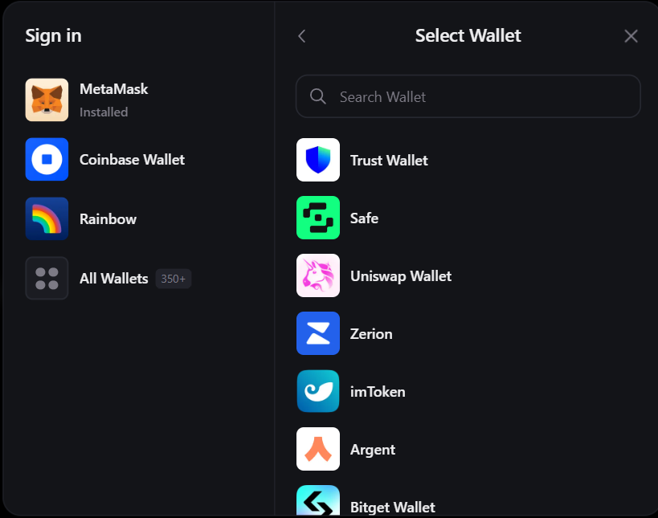
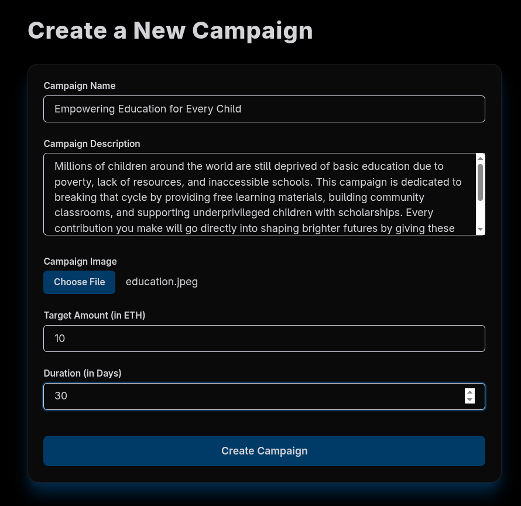
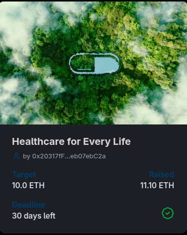
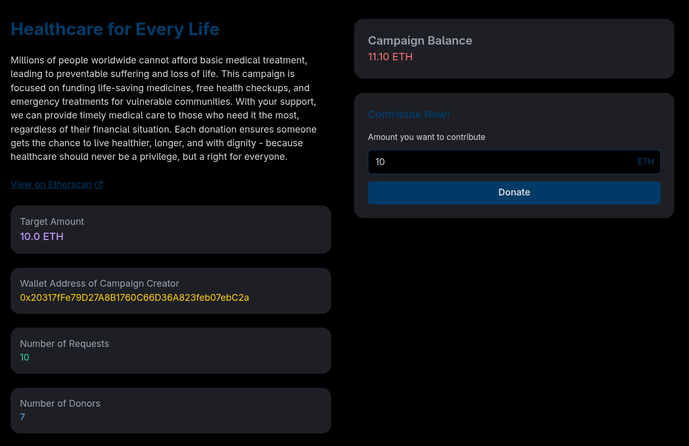
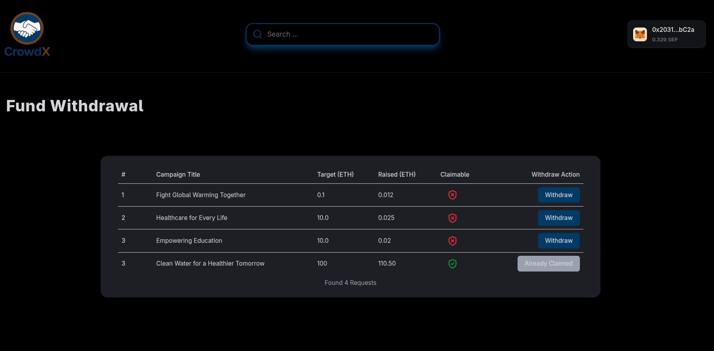
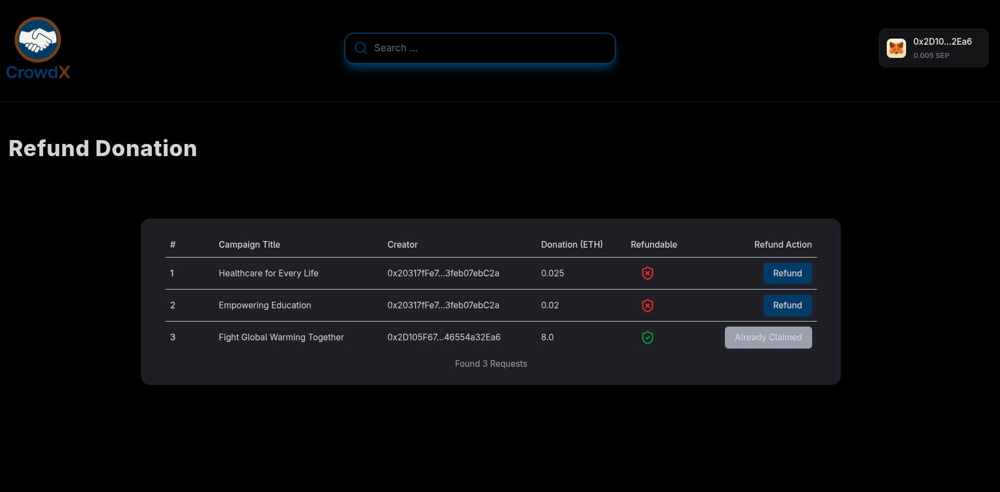

  <h1 align="center">🤝 CrowdX 🤝</h1>

 

- CrowdX is a **decentralized crowdfunding platform**.  
- The frontend connects with the CrowdX smart contract, enabling users to **create campaigns, contribute ETH, withdraw funds, and claim refunds** in a **secure and transparent way**.

 

##  Features

1. **Wallet Connection**  
   - Connect your wallet to get started.  
   - Supports 350+ wallets including **MetaMask, Coinbase Wallet, Rainbow**, and more.  
   - Secure popup integration powered by Web3 libraries. 
   
    

   

     
   
 

   ---
 

2. **Explore Campaigns**  
   - View all active campaigns currently accepting contributions.  
   - Search and filter campaigns easily.  
   - Track funding progress in real-time.  

   ---
    

3. **Create Campaign**  
   - Launch your own campaign in just a few steps.  
   - Add title, description, funding goal, and deadline.  
   - Instantly deployed on-chain.  
    

    

     
   
 
 
 ---
  

4. **Manage Campaigns**  
   - Explore and manage all campaigns you’ve created.  
   - Track contributions and monitor progress from your dashboard. 
    

    

     
   
 
 
 ---
  

5. **Donate to Campaigns**  
   - Contribute directly to powerful campaigns using your crypto wallet.  
   - Fast, secure, and transparent donations.  
   - Every transaction is logged on-chain.  
    
    

     
   
 

   ---
    

6. **Withdraw Funds**  
   - Campaign owners can securely withdraw funds once funding goals are met and the campaign ends.  
     
    

     
   
 

   ---
    

7. **Refund System**  
   - Contributors can claim a **full refund** if a campaign does not reach its funding target before the deadline.  
  
    

     
   
 

   
    
---

##  Tech Stack

- **Next.js** – React-based frontend framework  
- **Tailwind CSS** – Modern utility-first CSS styling 
- **shadcn/ui** – Reusable and accessible UI components for a clean design 
- **Solidity** – Powers the decentralized backend logic of CrowdX
- **Ethers.js / Thirdweb** – Wallet connection & blockchain interaction  
- **Hardhat** – Smart contract development & testing framework  

---
 

##  Connect

- 🌐 Project Repository: [GitHub Repo](https://github.com/Smitbhuva15/CrowdX/)  
- 👔 LinkedIn: [Smit Bhuva](https://www.linkedin.com/in/smit-bhuva-1007ba314/)  
- 📧 Email: bhuvasmit1507@gmail.com  

---

## ✨ Created By

**Smit Bhuva**  
 Web3 Developer | Solidity | Full Stack Developer  

- GitHub: [Smitbhuva15](https://github.com/Smitbhuva15)  
- LinkedIn: [Smit Bhuva](https://www.linkedin.com/in/smit-bhuva-1007ba314/)  
- 📧 Email: bhuvasmit1507@gmail.com  

