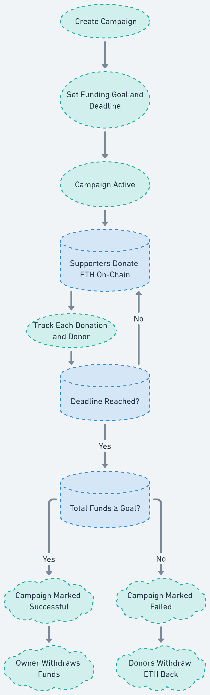

<h1 align="center">CrowdX Smart Contract</h1>

A decentralized crowdfunding smart contract built on Ethereum.  
It allows users to **create campaigns**, **donate ETH**, **withdraw funds if goals are met**, and **claim refunds if campaigns fail**.  
This contract is designed to ensure **trustless fundraising** without the need for intermediaries.  

---

## Overview

- Decentralized platform for crowdfunding.  
- Campaigns have a **title, description, goal amount, deadline, and owner**.  
- Users can **donate ETH** directly on-chain.  
- If the goal is reached before the deadline → campaign owner can **withdraw funds**.  
- If the goal is not reached before the deadline → contributors can **claim refunds**.  
- Transparent and immutable records of all donations.  

---

##  Features

1. **Create Campaign** – Any user can create a campaign with a goal and deadline.  
2. **Donate ETH** – Contributors can fund campaigns using `donate()`.  
3. **Track Donations** – Each donor’s contribution is stored securely.  
4. **Withdraw Funds** – Campaign owners can withdraw if the goal is met.  
5. **Refunds** – Contributors can reclaim funds if the campaign fails.  
6. **Event Logging** – All actions emit events for easy off-chain indexing.  

---

##  Functions

- `createCampaign(string memory _title, string memory _description, uint256 _goal, uint256 _deadline)`  
  ➝ Creates a new campaign.  

- `donate(uint256 _id)`  
  ➝ Allows users to donate ETH to a campaign.  

- `withdraw(uint256 _id)`  
  ➝ Lets campaign owner withdraw funds if conditions are met.  

- `refund(uint256 _id)`  
  ➝ Allows contributors to claim refunds if the goal isn’t met.  

- `getCampaign(uint256 _id)`  
  ➝ Returns campaign details.  

- `getMyDonations(uint256 _id)`  
  ➝ Returns contributions of a donor for a specific campaign.  

---

##  How It Works

  

---
1. **Campaign Creation**  
   - A user creates a campaign with a funding goal and deadline.  

2. **Funding the Campaign**  
   - Supporters donate ETH directly on-chain.  
   - Each donation is tracked and linked to the donor.  

3. **Checking Progress**  
   - If total funds ≥ goal **before deadline** → campaign marked as successful.  
   - Otherwise → campaign marked as failed.  

4. **Post-Campaign Actions**  
   - **Successful campaign** → owner withdraws funds.  
   - **Failed campaign** → donors withdraw their ETH back.  

---

##  Connect

- 🌐 Project Repository: [GitHub Repo](https://github.com/Smitbhuva15/CrowdX/)  
- 👔 LinkedIn: [Smit Bhuva](https://www.linkedin.com/in/smit-bhuva-1007ba314/)  
- 📧 Email: bhuvasmit1507@gmail.com  

---

## ✨ Created By

**Smit Bhuva**  
 Web3 Developer | Solidity | Full Stack Developer  

- GitHub: [Smitbhuva15](https://github.com/Smitbhuva15)  
- LinkedIn: [Smit Bhuva](https://www.linkedin.com/in/smit-bhuva-1007ba314/)  
- 📧 Email: bhuvasmit1507@gmail.com  

